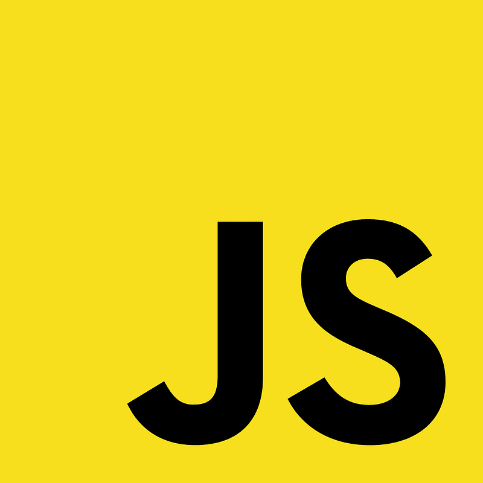

# JavaScript_Raul
 
 

# Descrição

 Respositório criado para organização dos estudos e dos projetos focados em JavaScript ECMAScript 6 (2015) / ECMAScript 12 (2021).
 O objetivo após o estudo dos fundamentos da linguagem é a especializção em NodeJS, AngularJS e ReactJS.

## Agradecimentos 

Agradeço aos meus amigos e companheiros que me incentivam a buscar o constante aprimoramento das minhas habilidades e conhecimentos.

 Homo Homini Lupus 

